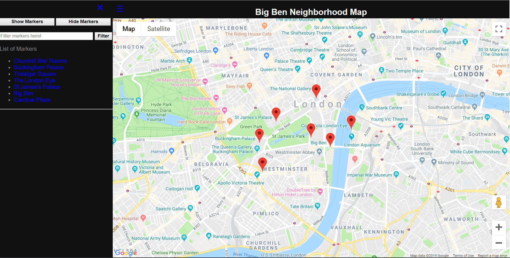
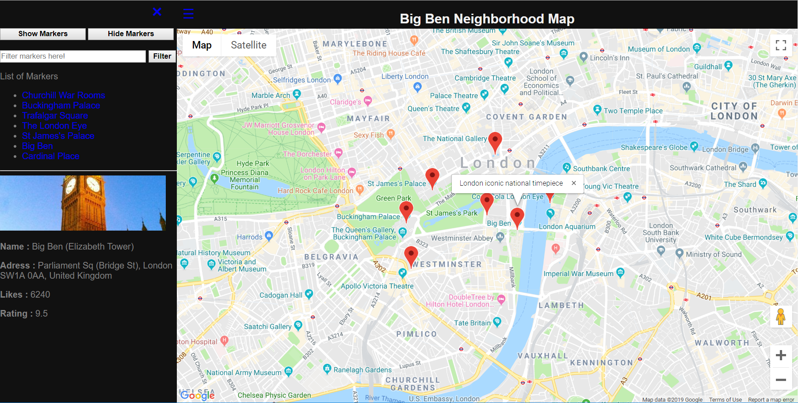
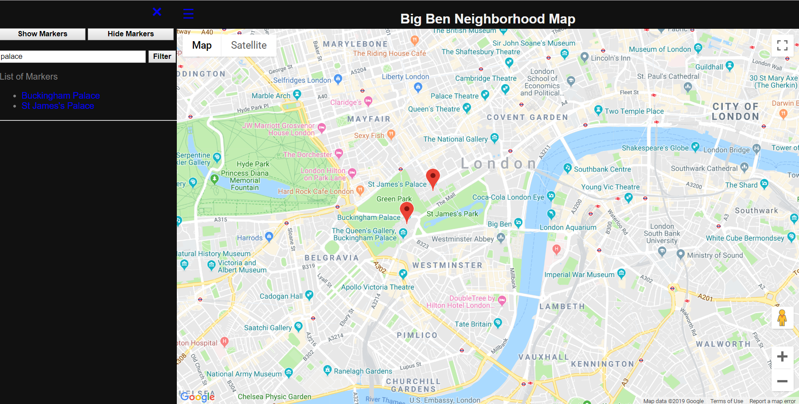
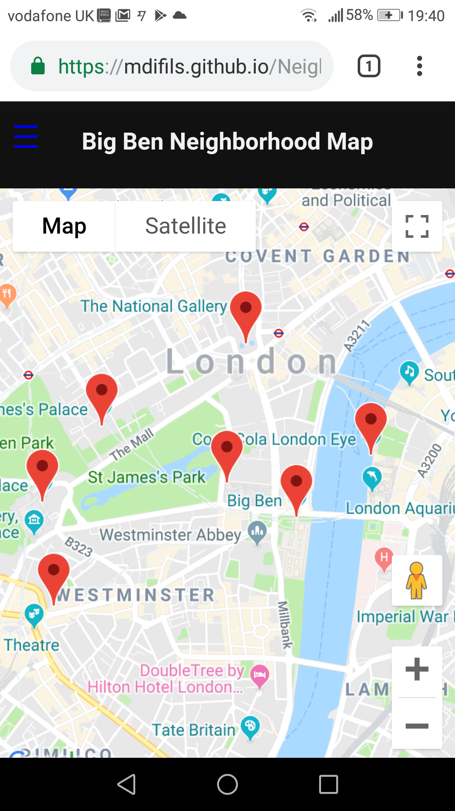
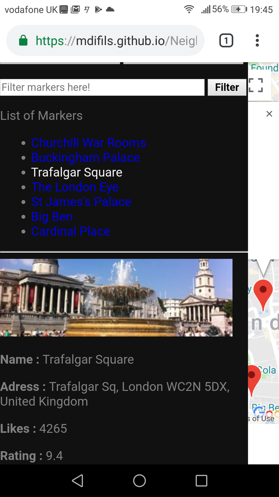
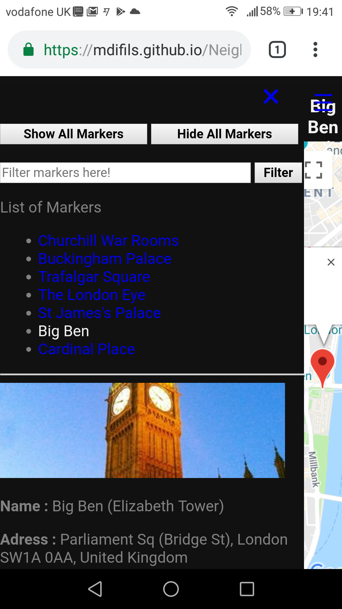

# Big Ben Neighborhood Map

This project is developed as part of my Udacity Nano Degree Program. It is a
single webpage that displays the Big Ben neighborhood map with seven points of
interest: Big Ben, Buckingham Palace, Cardinal Place, Churchill War Rooms,
St James's Palace, The London Eye and Trafalgar Square.

Each point of interest is represented by a red marker on the map. And on the left
sidebar, you can also see a list of all points of interest. Those items list are
linked with the corresponding markers on the map. Clicking on the marker is
equivalent to clicking on the corresponding item in the list. An info window will
pop up on the map with a short description of that point. The additional information
will be displayed on the sidebar. Closing the info window will make additional
information on the sidebar to also disappear.

By default, all markers appear on the map, but you can hide them all  with the
**Hide Markers button** button and display them again with the **show Markers**
button. The search box allows to filter the markers, only markers that
contain the pattern you type enter in that box will appear.

## Attributions

The following technologies have been used in order to provide you all the above
functionalities:

* [Google Maps API](https://developers.google.com/maps/) : To load the map on my
and to create markers at points of interest.
* [Knockout](https://knockoutjs.com/index.html) : To handle the list, the filter
and every dynamic change in the view (UI).
* [Foursquare API](https://developer.foursquare.com/) : To get additional information
about points of interest: picture, address, number of likes and ratings.
* HTML, CSS, BOOTSTRAP, JAVASCIPT: for the structure, style, responsiveness and interactivity of
the webpage.

## Preview

All markers appear by default, then you can hide them all, make them visible
again and filter them.

Clicking on a marker or an item in the list display an information window on the
map and some additional information on the sidebar.

Filtering the list filter markers as well on the map.

Small screen view.

## Instructions

* Download the files or clone this [repository](https://github.com/mdifils/NeighborhoodMap).
* Open the file index.html in your browser and enjoy.
* Since AJAX request to local file system isn't working in Chrome, there is no
need to use locations.json file. Instead, the program will be downloading that file
from a server using Ajax.
